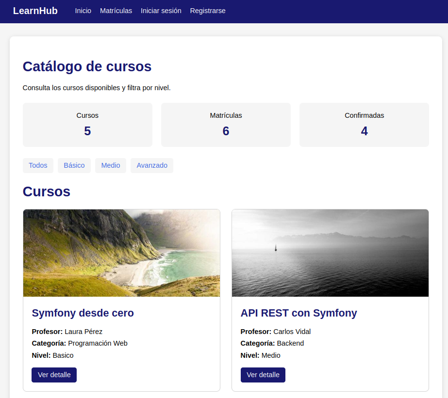
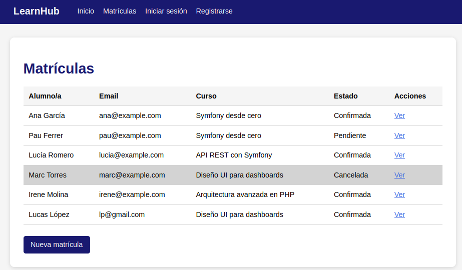
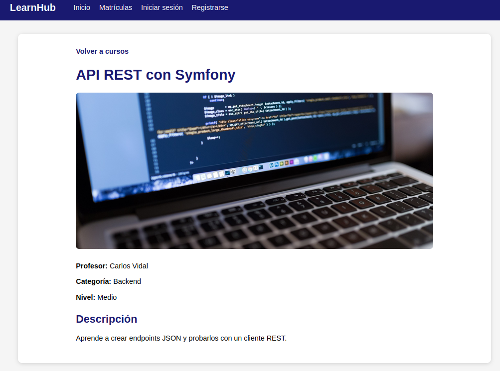

# LearnHub

LearnHub es una aplicación web desarrollada con Symfony para la gestión de cursos y matrículas.

El proyecto permite consultar los cursos disponibles, filtrar por nivel, ver la información de cada curso y gestionar las matrículas de los alumnos.

## Funcionalidades

- Listado de cursos.
- Filtro de cursos por nivel.
- Detalle de cada curso mediante slug.
- Gestión de matrículas.
- Registro e inicio de sesión de usuarios.
- Edición y eliminación de matrículas para usuarios autenticados.
- Estadísticas de cursos y matrículas.
- API REST para consultar los cursos.
- Colección de Bruno para probar la API.

## Tecnologías utilizadas

- PHP
- Symfony 7
- Doctrine ORM
- MySQL / MariaDB
- Twig
- HTML
- CSS
- Git
- Bruno

## API REST

La aplicación dispone de un endpoint para consultar los cursos:

`GET /api/courses/`

También se pueden filtrar los cursos por nivel:

`GET /api/courses/?nivel=Basico`

`GET /api/courses/?nivel=Medio`

`GET /api/courses/?nivel=Avanzado`

La colección de Bruno utilizada para probar estos endpoints está incluida en el proyecto.

## Instalación

Clonar el repositorio:

```bash
  git clone https://github.com/jossmall/learnhub-symfony.git
```

Instalar las dependencias:

```bash
  composer install
```

Levantar la base de datos con Docker:

```bash
  docker compose up -d
```

Ejecutar las migraciones:

```bash
  php bin/console doctrine:migrations:migrate
```

El archivo `learnhub.sql` incluye datos de ejemplo. Para importarlos:

```bash
  docker exec -i learnhub_database mariadb -uroot -proot learnhub < learnhub.sql
```

Iniciar el servidor:

```bash
  symfony server:start
```

## Capturas

### Catálogo de cursos



### Detalle de un curso



### Gestión de matrículas


